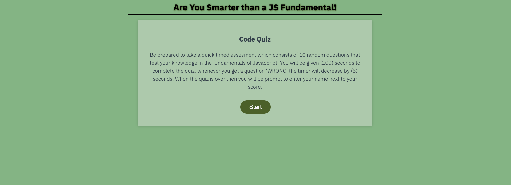

# Code Quiz

## Description

* Thankfully for Code Quiz a current coding bootcamp student is able to take a timed quiz of 10 questions regarding the Fundamentals of JavaScript. The user will be prompt about questions to test out their knowledge so far, and save their highscores at the end of the quiz. 

## Screenshot

## Website

* https://kevin-hernandez-garza.github.io/codeQuiz/

### Made with 💜 by Kevin Hernandez